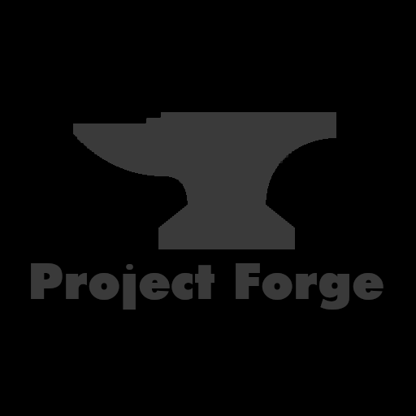

# Project Forge

## Description
Forge is a build/project manager which handles
- dependencies
- build process
- project configuration
- project management
- project versioning

## **Building**

(***Note***: Forge is built and tested in a linux environment. It may not work in other environments. However we are working on a windows version)

### All build methods
Forge needs to be cloned into your computer to be built and used. To clone the repository, run the following command: ***`$git clone MrBlueBlobGuy/forge`***

### Using Forge
projectforge is built using itself. To build projectforge, run the following command: ***`$projectforge build`***

### Using make
projectforge can also be built using make. To build projectforge using make, run the following command: ***`$make`***

## Documentation
All Documentation is available in the manual directory of the repository. The documentation is in markdown format. and might or might not have images we are working on it.

## Who am I?
I am a student who is passionate about programming and software development. I am currently working on this project as a hobby and to learn more about software development. I am open to contributions and suggestions. Feel free to contact me at ***``***